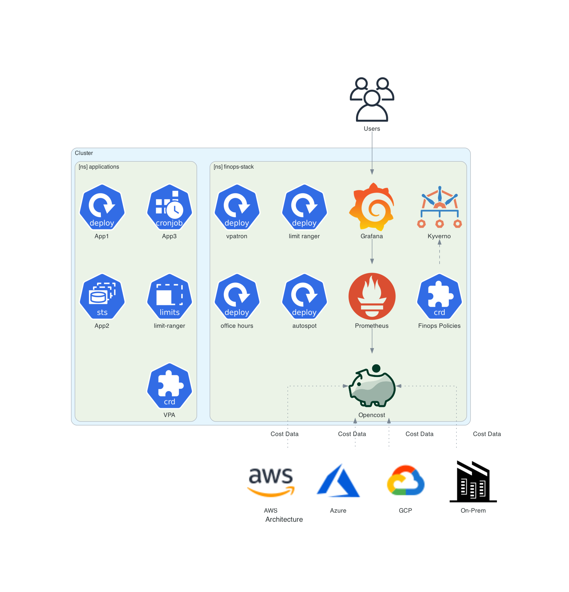

# The OpenStack Architecture

FinOps Stack makes use of a wide range of software to provide a highly efficient Stack:

- **[Kyverno](https://kyverno.io/)**: A Kubernetes-native policy engine that helps enforce, validate, and mutate resource configurations, allowing users to define and manage security, operational, and compliance policies directly as Kubernetes resources. In the FinOps Stack, Kyverno is used to audit or enforce FinOps best practices.
- **[OpenCost](https://www.opencost.io/)**: An open-source cost monitoring and management tool for Kubernetes, designed to provide real-time visibility into the costs associated with workloads, resources, and cloud infrastructure usage in a Kubernetes cluster. In the Stack, we use the OpenCost Prometheus exporter to gather cost metrics, and send these to Google Managed Prometheus. 
- **[Goldilocks](https://www.fairwinds.com/goldilocks)**: Fairwinds Goldilocks is designed to provide 'just-right' recommendations for container requests and limits. It does this by using the [Vetical Pod Autoscaler](https://github.com/kubernetes/autoscaler/blob/master/vertical-pod-autoscaler/README.md) in recommendation mode. Additional guidance on interpresting and setting resource reqwuests and limits can be found in our distribution-gke-autopilot guide.
- **[Grafana](https://grafana.com/grafana/)**: An open-source platform used for monitoring and visualising time-series data from various sources, allowing users to create interactive and real-time dashboards for metrics, logs, and analytics. The FinOps Stack uses Grafana to provide visualisations of cost and efficiency metrics.
- - **gmp-proxy**: A proxy designed to simplify the integration between open-source Grafana and Google Managed Prometheus.

## What does this look like:

This Diagram describes what the FinOps Stack looks like within your cluster:

