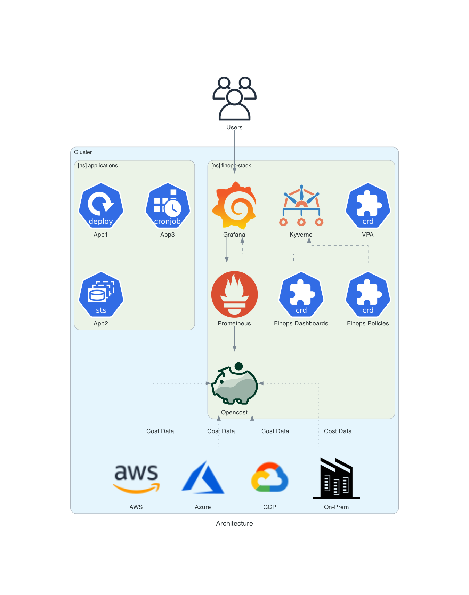

# The OpenStack Architecture

FinOps Stack makes use of a wide range of software to provide a highly efficient Stack:

- **[Kyverno](https://kyverno.io/)**: A Kubernetes-native policy engine that helps enforce, validate, and mutate resource configurations, allowing users to define and manage security, operational, and compliance policies directly as Kubernetes resources.​
- **[OpenCost](https://www.opencost.io/)**: An open-source cost monitoring and management tool for Kubernetes, designed to provide real-time visibility into the costs associated with workloads, resources, and cloud infrastructure usage in a Kubernetes cluster.
- **[Prometheus](https://prometheus.io/)**: An open-source monitoring and alerting toolkit designed for collecting and storing time-series data, primarily focused on metrics from systems and applications, and providing powerful querying, alerting, and visualisation capabilities.
- **[Grafana](https://grafana.com/grafana/)**: An open-source platform used for monitoring and visualising time-series data from various sources, allowing users to create interactive and real-time dashboards for metrics, logs, and analytics.​
- **[Vertical Pod Autoscaler](https://github.com/kubernetes/autoscaler/blob/master/vertical-pod-autoscaler/README.md)**: frees users from the necessity of setting up-to-date resource limits and requests for the containers in their pods. When configured, it will set the requests automatically based on usage and thus allow proper scheduling onto nodes so that appropriate resource amount is available for each pod.

## What does this look like:

This Diagram describes what the FinOps Stack looks like within your cluster:

